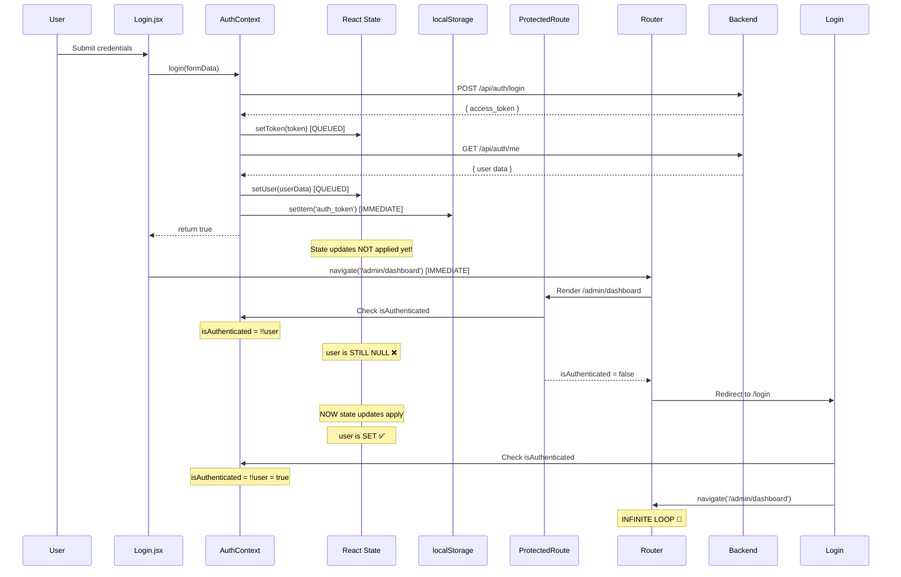
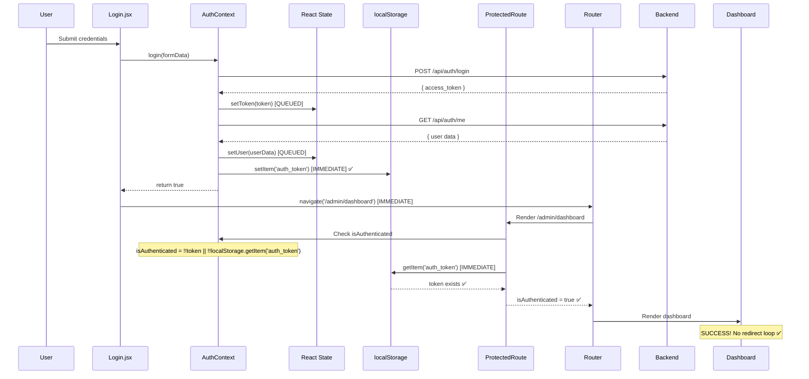

# Login Race Condition - Visual Diagram

## 🔴 BEFORE FIX (Buggy Flow)



---

## ✅ AFTER FIX (Working Flow)



---

## 🔍 Key Difference

| Aspect | Before Fix (Buggy) | After Fix (Working) |
|--------|-------------------|---------------------|
| **Check Method** | `!!user` (React state) | `!!localStorage.getItem('auth_token')` |
| **Timing** | Asynchronous (queued) | Synchronous (immediate) |
| **When Available** | After next render | Immediately after login |
| **Race Condition** | ❌ Yes (navigate faster than setState) | ✅ No (localStorage set before navigate) |
| **Result** | Redirect loop 🔄 | Works correctly ✅ |

---

## 📊 Timing Comparison

### Before Fix (Race Condition)

```
Time  | Event
------|--------------------------------------------------
0ms   | login() starts
50ms  | setToken() queued
100ms | setUser() queued
150ms | localStorage.setItem() ← IMMEDIATE ✅
151ms | return true
152ms | navigate() ← IMMEDIATE
153ms | ProtectedRoute checks user ← STILL NULL ❌
154ms | Redirect to /login
200ms | React applies state updates ← TOO LATE
201ms | user is now set
202ms | Login checks isAuthenticated = true
203ms | navigate() again
204ms | LOOP 🔄
```

### After Fix (No Race Condition)

```
Time  | Event
------|--------------------------------------------------
0ms   | login() starts
50ms  | setToken() queued
100ms | setUser() queued
150ms | localStorage.setItem() ← IMMEDIATE ✅
151ms | return true
152ms | navigate() ← IMMEDIATE
153ms | ProtectedRoute checks localStorage ← HAS TOKEN ✅
154ms | Render dashboard ← SUCCESS ✅
200ms | React applies state updates (for UI)
```

---

## 🎯 Root Cause Summary

**The Problem:**
- React state updates (`setUser`) are **asynchronous** (queued for next render)
- Navigation (`navigate`) is **synchronous** (executes immediately)
- `ProtectedRoute` checks `isAuthenticated` **before** state updates apply

**The Solution:**
- Use `localStorage.getItem('auth_token')` which is **synchronous**
- localStorage is already set **before** navigation
- No race condition because both are synchronous

**Why localStorage Works:**
- `localStorage.setItem()` is synchronous (blocking)
- `localStorage.getItem()` is synchronous (blocking)
- Both complete before `navigate()` executes
- No dependency on React render cycle

---

## 🔬 Technical Deep Dive

### React State Update Lifecycle

```javascript
// When you call setState:
setUser(userData);  // ← Does NOT update immediately

// React queues the update:
updateQueue.push({ state: 'user', value: userData });

// React processes queue on next render:
// 1. Trigger re-render
// 2. Apply all queued updates
// 3. Call render()
// 4. Update DOM

// Meanwhile, your code continues:
return true;  // ← Executes BEFORE state updates
```

### localStorage Operations

```javascript
// localStorage is synchronous:
localStorage.setItem('key', 'value');  // ← Blocks until complete
console.log('After setItem');  // ← Executes AFTER setItem completes

const value = localStorage.getItem('key');  // ← Blocks until complete
console.log(value);  // ← Executes AFTER getItem completes
```

### Why Mixing Them Causes Issues

```javascript
// BAD: Mixing async state with sync navigation
setUser(userData);  // ← Queued (async)
navigate('/dashboard');  // ← Immediate (sync)
// navigate() executes BEFORE setUser() applies

// GOOD: Using sync localStorage
localStorage.setItem('token', token);  // ← Immediate (sync)
navigate('/dashboard');  // ← Immediate (sync)
// Both complete in order
```

---

## 📚 References

**React Documentation:**
- [State Updates May Be Asynchronous](https://react.dev/learn/queueing-a-series-of-state-updates)
- [useState Hook](https://react.dev/reference/react/useState)

**Web APIs:**
- [localStorage (MDN)](https://developer.mozilla.org/en-US/docs/Web/API/Window/localStorage)
- [Storage API (MDN)](https://developer.mozilla.org/en-US/docs/Web/API/Storage)

**Related Concepts:**
- Race Conditions in JavaScript
- React Render Cycle
- Synchronous vs Asynchronous Operations
- Authentication State Management
